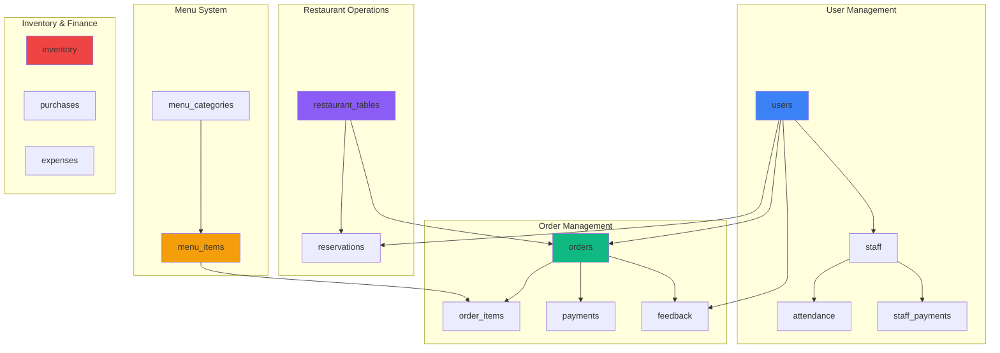

# 🗄️ The Cheeze Town - Complete Database Setup

## 📋 Quick Start

### 1️⃣ Copy the SQL Script
The complete SQL script is in: **`supabase-setup.sql`**

### 2️⃣ Run in Supabase
1. Go to: https://hncahlshvismwagbcryi.supabase.co
2. Click **"SQL Editor"** → **"New Query"**
3. Paste the entire contents of `supabase-setup.sql`
4. Click **"Run"** (Ctrl+Enter)

### 3️⃣ Verify
Go to **"Table Editor"** and you should see 15 tables with sample data!

---

## 📊 Database Architecture



---

## 🗂️ Complete Table List

| # | Table Name | Purpose | Sample Data |
|---|------------|---------|-------------|
| 1 | **users** | User accounts (owner, manager, chef, etc.) | - |
| 2 | **menu_categories** | Menu organization | 5 categories |
| 3 | **menu_items** | Menu items with prices | 16 items |
| 4 | **restaurant_tables** | Table management | 10 tables |
| 5 | **orders** | Customer orders | - |
| 6 | **order_items** | Items in each order | - |
| 7 | **payments** | Payment transactions | - |
| 8 | **staff** | Employee records | - |
| 9 | **staff_payments** | Salary/bonus payments | - |
| 10 | **purchases** | Inventory purchases | - |
| 11 | **inventory** | Stock management | - |
| 12 | **expenses** | Business expenses | - |
| 13 | **reservations** | Table reservations | - |
| 14 | **feedback** | Customer reviews | - |
| 15 | **attendance** | Staff attendance | - |

---

## 🎯 Integration Examples

### Chef Dashboard
```typescript
// Get pending orders in real-time
const { data: orders } = useSupabaseRealtimeQuery('orders');
const pendingOrders = orders.filter(o => o.status === 'pending');
```

### Manager - Tables
```typescript
// Get all tables with current orders
const { data } = await supabase
  .from('restaurant_tables')
  .select('*, current_order:orders(*)')
  .order('table_number');
```

### Manager - Menu
```typescript
// Get menu items by category
const { data } = await supabase
  .from('menu_items')
  .select('*, category:menu_categories(*)')
  .eq('is_available', true);
```

### Owner - Analytics
```typescript
// Get today's revenue
const { data } = await supabase
  .from('orders')
  .select('total_amount')
  .eq('status', 'completed')
  .gte('created_at', new Date().toISOString().split('T')[0]);
```

---

## ⚡ Automatic Features

### 1. Order Number Generation
- **ORD000001**, **ORD000002**, etc.
- Auto-generated on insert

### 2. Order Total Calculation
- Automatically sums all order_items
- Updates when items are added/removed

### 3. Inventory Status
- **in-stock**: Normal
- **low-stock**: Below reorder level  
- **out-of-stock**: Quantity = 0
- **expired**: Past expiry date

### 4. Timestamp Updates
- `created_at`: Set on insert
- `updated_at`: Auto-updates on change

---

## 🔒 Security (RLS)

### Enabled on All Tables ✅

**Public Access:**
- ✅ Read menu items (available only)
- ✅ Read menu categories

**Authenticated Users:**
- ✅ Full CRUD on orders
- ✅ Full CRUD on payments
- ✅ Full CRUD on staff records
- ✅ Full CRUD on inventory

**Anonymous:**
- ✅ View available menu items
- ✅ Submit feedback

---

## 📦 Sample Data Included

### Menu Categories (5)
- Pizza
- Burgers  
- Sides
- Beverages
- Desserts

### Menu Items (16)
- Margherita Pizza - ₹299
- Farmhouse Pizza - ₹349
- Tandoori Paneer Pizza - ₹399
- Chicken Supreme Pizza - ₹449
- Classic Burger - ₹199
- Veggie Burger - ₹179
- French Fries - ₹99
- Garlic Bread - ₹89
- Coke - ₹49
- And more...

### Restaurant Tables (10)
- Tables 1-5: Indoor (2-6 capacity)
- Tables 6-8: Outdoor (6-8 capacity)
- Tables 9-10: VIP (2-4 capacity)

---

## 🧪 Test After Setup

```typescript
import { database } from '@/services/database';

// 1. Test connection
const { data: menuItems } = await database.getAll('menu_items');
console.log('Menu Items:', menuItems?.length); // Should show 16

// 2. Test tables
const { data: tables } = await database.getAll('restaurant_tables');
console.log('Tables:', tables?.length); // Should show 10

// 3. Create a test order
const { data: order } = await database.insert('orders', {
  table_id: 1,
  status: 'pending',
  total_amount: 200,
  order_type: 'dine-in'
});
console.log('Order created:', order);
```

---

## 📁 Files in This Setup

1. **`supabase-setup.sql`** - Complete SQL script (paste in Supabase)
2. **`config/supabase.ts`** - Supabase client config
3. **`services/database.ts`** - Database service with helpers
4. **`hooks/useSupabase.ts`** - React hooks for database
5. **`types/database.ts`** - TypeScript types
6. **`docs/SUPABASE_SETUP.md`** - Full documentation
7. **`docs/SQL_SETUP_GUIDE.md`** - This guide
8. **`docs/database-examples.tsx`** - Code examples

---

## ✅ Checklist

- [ ] Open Supabase SQL Editor
- [ ] Copy contents of `supabase-setup.sql`
- [ ] Paste into SQL Editor
- [ ] Click "Run"
- [ ] Verify 15 tables created
- [ ] Check menu_items has 16 items
- [ ] Check restaurant_tables has 10 tables
- [ ] Test connection in your app
- [ ] Start integrating into screens

---

## 🎉 You're Ready!

Your database is fully set up with:
- ✅ All tables with proper relationships
- ✅ Indexes for performance
- ✅ Triggers for automation
- ✅ RLS policies for security
- ✅ Sample data to get started

**Start building your app features now!** 🚀
