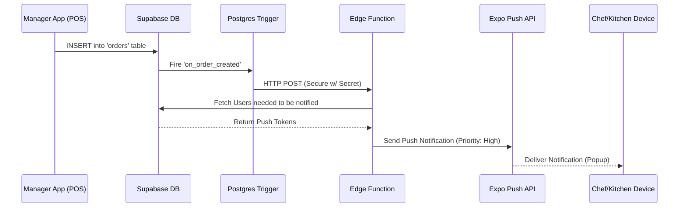

# Notification System Implementation

This document details the end-to-end implementation of the Order Notification System in **The Cheeze Town**, enabling real-time alerts for Chefs, Managers, and Owners when new orders arrive.

## 🏗️ System Architecture

The system uses an **Event-Driven Architecture**:
`Database Event` -> `Supabase Trigger` -> `Edge Function` -> `Expo Push Service` -> `User Device`

---

## 1. Database Layer (The Trigger)

We use PostgreSQL Triggers and `pg_net` to detect changes and call our external function immediately.

-   **Extensions**: `pg_net` is enabled to allow the database to make HTTP requests.
-   **Trigger Function**: `public.handle_new_order()`
    -   **Trigger**: `AFTER INSERT ON public.orders`
    -   **Action**: Sends an HTTP POST request to the Supabase Edge Function URL.
    -   **Security**: Includes a shared secret (`X-Order-Notification-Secret`) in the header to prevent unauthorized access.
-   **Secondary Trigger**: `public.handle_order_item_insert()`
    -   **Trigger**: `AFTER INSERT ON public.order_items`
    -   **Logic**: Debounces notifications (waits 2 seconds after order creation) to avoid double-notifying for the initial items of a new order. Only notifies for *subsequent* items added to an existing order.

**Reference File**: `supabase/migrations/20260109115000_secure_triggers_with_secret.sql`

---

## 2. Backend Layer (The Edge Function)

A Supabase Edge Function acts as the secure middleman. It keeps your Expo Access Token secure and handles logic.

-   **Path**: `supabase/functions/order-notification/index.ts`
-   **Authentication**:
    -   Validates the `X-Order-Notification-Secret` header matches the server-side environment variable.
-   **Logic**:
    1.  Receives the `record` (Order Data) from the DB Trigger.
    2.  Constructs the Notification Title & Body (e.g., "New Order #123 🍔").
    3.  Queries the `users` table to find all users with roles `['chef', 'manager', 'owner']` who have a valid `expo_push_token`.
    4.  Batches and sends the requests to Expo's Push API (`https://exp.host/--/api/v2/push/send`).
    5.  **Critical Config**: Sends `channelId: 'Orders_v4'` and `priority: 'high'` to ensure the notification pops up loudly on Android.

---

## 3. Frontend Layer (React Native / Expo)

The application handles registering the device and displaying the notification.

### A. Token Registration (`AuthContext.tsx`)
-   When a user logs in (or app loads), the `AuthContext` checks if the user is a `chef`, `manager`, or `owner`.
-   It calls `NotificationService.registerForPushNotificationsAsync()`.
-   It saves the returned **Expo Push Token** to the `users` table in Supabase.

### B. Notification Configuration (`NotificationService.ts`)
-   **Android Channel**: Creates a custom notification channel named `Orders_v4` (or `v5` if reset is needed).
-   **Importance**: Sets `importance: Notifications.AndroidImportance.MAX`.
-   **Sound**: Uses custom sound `belli.wav` (Production) or `default` (Expo Go).
-   **Force Reset**: Includes logic to delete and recreate the channel on boot to ensure Importance settings are always applied correctly (fixing "silent" notification bugs).

### C. In-App Handling (`OrderNotificationContext.tsx`)
-   Listens for incoming notifications while the app is in the **Foreground**.
-   Plays a sound immediately.
-   Shows a custom in-app banner (`OrderNotificationBanner.tsx`) so the user doesn't miss it even if looking at the screen.

---

## 4. Setup & Configuration

### Environment Variables (.env)
-   `ORDER_NOTIFICATION_SECRET`: A generated random string shared between the DB Trigger and the Edge Function.
-   `EXPO_PUBLIC_SUPABASE_URL`: Your Supabase Project URL.
-   `EXPO_PUBLIC_SUPABASE_ANON_KEY`: Public Client Key.

### Permissions
-   **Android**: Uses standard `POST_NOTIFICATIONS` permission (User must allow).
-   **iOS**: Requires an Apple Developer Account and Push Certificate setup in Expo (EAS).

---

## 5. Verification Tools

We created scripts to verify the system without needing to make real transactions:
-   `node scripts/test-push.js`: Simulates a DB Insert (End-to-End Test).
-   `node scripts/test-notification-direct.js`: Calls the Edge Function directly (Bypasses DB Trigger).

---
